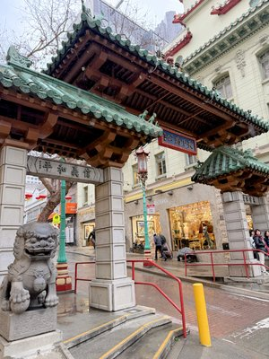
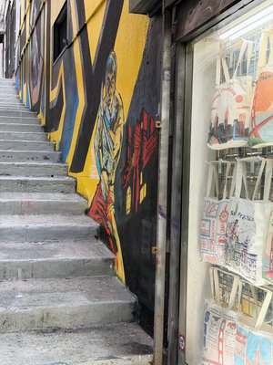
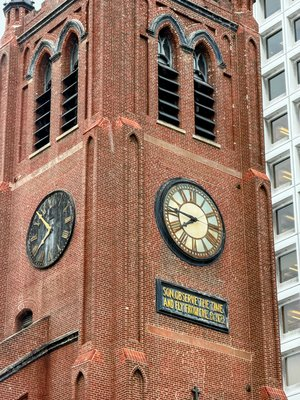
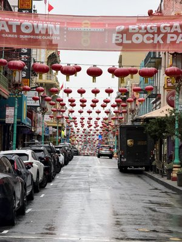
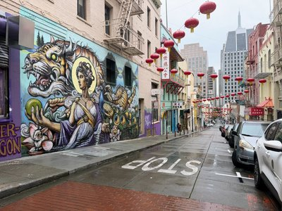

# photo-ai Gallery Demo

*2026-02-19T23:32:30Z by Showboat dev*
<!-- showboat-id: f0ac87a3-37e7-421a-b6cb-d3c429bd77d3 -->

The `publish` command generates a self-contained markdown gallery with embedded thumbnail images. Each photo is resized to 400px and base64-encoded into `` tags — GitHub Gist renders these inline, no external hosting needed.

## Generate a gallery

```bash
uv run analyze.py publish --top 5 --title 'SF Feb 2026'
```

```output
Gallery written to gallery.md (5 photos, 301,377 bytes)
```

5 photos, 301 KB — about 60 KB per thumbnail. Here's the rendered output:

---

## SF Feb 2026

5 photos · analyzed with qwen/qwen3-vl-30b

---

### Chinatown Drift
**Score: 6/7** (Excellent) · street · Chinatown Gate, San Francisco, CA

```bash {image}
tmp/thumbs/IMG_8837.jpg
```



*Snow falls on a quiet Chinatown entrance*

Tags: street, building, cinematic, moody, snow
Elements: rule_of_thirds, leading_lines, framing, depth

---

### Urban Ascent
**Score: 6/7** (Excellent) · street · Lombard Street, San Francisco, CA

```bash {image}
tmp/thumbs/IMG_8846.jpg
```



*The city's pulse in a single frame*

Tags: street, urban, person, building, architecture, dramatic, energetic, moody
Elements: leading_lines, depth, framing

---

### Doomsday Clock
**Score: 6/7** (Excellent) · architecture · Church of the Holy Cross, Boston, MA

```bash {image}
tmp/thumbs/IMG_8852.jpg
```



*Time to flee from evil*

Tags: architecture, building, urban, street, dramatic, sky, weather
Elements: rule_of_thirds, leading_lines, symmetry, depth

---

### Red Lanterns and Rain
**Score: 6/7** (Excellent) · street · Chinatown, San Francisco, CA

```bash {image}
tmp/thumbs/IMG_8856.jpg
```



*Chinatown's quiet after the rain*

Tags: street, vehicle, cinematic, moody, rain
Elements: leading_lines, depth, framing

---

### Chinatown Reverie
**Score: 6/7** (Excellent) · urban · Chinatown, San Francisco, CA

```bash {image}
tmp/thumbs/IMG_8860.jpg
```



*Rain-slicked streets, a vibrant mural*

Tags: street, building, vehicle, animal, cinematic, dramatic, moody, energetic
Elements: leading_lines, depth, framing

---

## How it works

The `publish` command:

1. Queries top N photos from the SQLite database (sorted by score)
2. Resizes each photo to 400px max width using Pillow
3. Base64-encodes the JPEG thumbnail
4. Builds markdown with `` tags
5. Writes to `gallery.md` (or pushes to GitHub Gist with `--gist`)

No external hosting, no image URLs to break — the gallery is fully self-contained.

## Publishing to Gist

Add `--gist` to push directly to GitHub. Add `--public` to make it world-visible.

```bash
echo 'uv run analyze.py publish --top 5 --title "SF Feb 2026" --gist --public'
```

```output
uv run analyze.py publish --top 5 --title "SF Feb 2026" --gist --public
```

This creates a public GitHub Gist with the full gallery markdown — thumbnails render inline. Requires the `gh` CLI to be authenticated.
